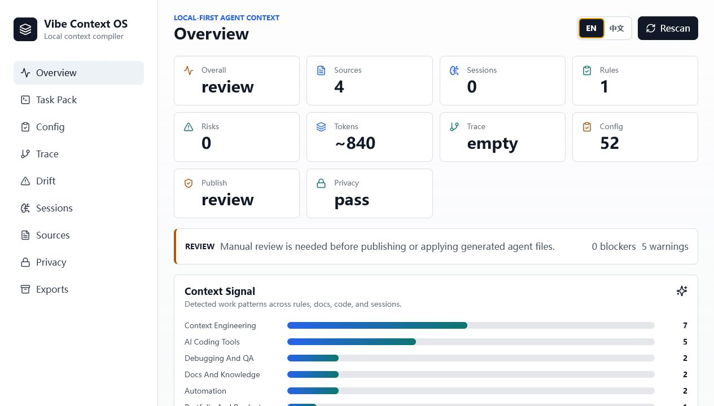
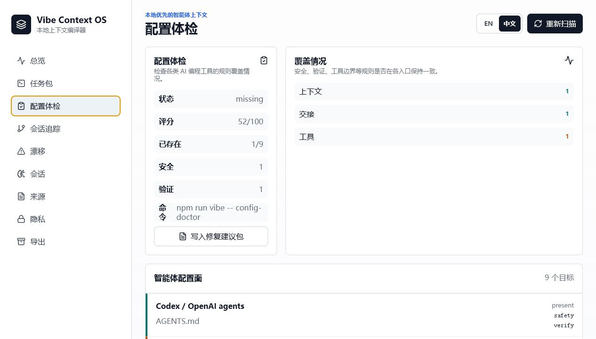
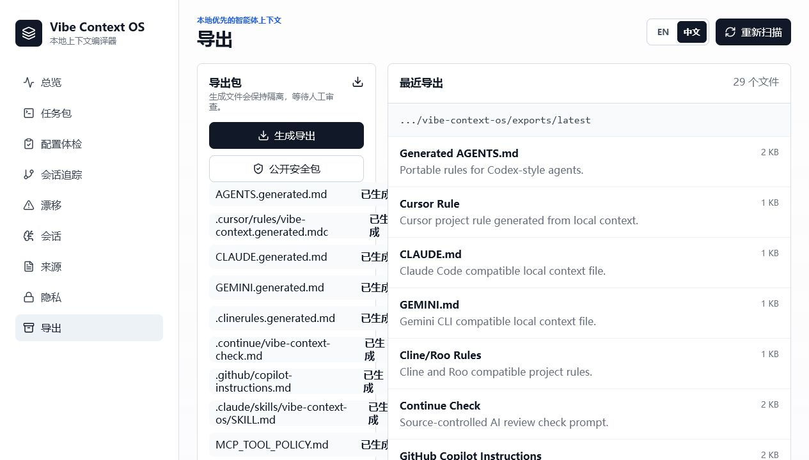
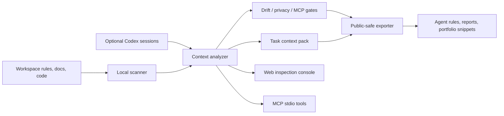

# Vibe Coding Context OS

Local-first context engineering OS for AI coding workflows. It scans project rules, Codex sessions, and repository signals, then turns them into a reusable context map, generated agent rules, guardrails, and GitHub-ready portfolio material.

[中文说明](README.zh-CN.md)

## Why this exists

AI coding gets powerful when the context is organized. Most developers lose value because rules live in scattered files, sessions vanish after the task, and good prompts never become reusable process. Vibe Coding Context OS turns that messy work into durable engineering assets.

The primary interface is agent-native: use the bundled skill, CLI, MCP server, or Claude Code command templates from inside Codex, Claude Code, Cursor, Gemini CLI, Aider, Cline, or a normal terminal. The web app is the inspection console for scans, privacy posture, and generated artifacts.

## Who it is for

Vibe Context OS is for developers who already use AI coding agents and need a repeatable way to manage project rules, task context, privacy gates, MCP/tool policies, and public-safe engineering evidence.

It is not a replacement for Codex, Claude Code, Cursor, Gemini CLI, Cline, or Continue. It is the local context layer that helps those tools receive cleaner instructions and safer handoffs.

## Preview



The screenshot above uses the bundled public-safe demo workspace. It shows the core loop: scan local context, inspect readiness, then export reviewable agent assets without exposing private sessions or absolute paths.

## Visual tour

| Overview | Chinese Config Doctor | Export release gates |
| --- | --- | --- |
|  |  |  |

## Features

- Scan `AGENTS.md`, `CLAUDE.md`, `GEMINI.md`, `.cursor/rules`, Cline/Roo rules, Continue checks, GitHub instructions, docs, and project manifests.
- Parse recent Codex JSONL sessions locally.
- Classify work into context engineering, implementation, research, infra, docs, and automation tracks.
- Detect obvious secret leaks and risky AI-agent patterns.
- Generate exportable `AGENTS.md`, Cursor rule, `CLAUDE.md`, `GEMINI.md`, Cline/Roo rules, Continue review prompt, GitHub Copilot instructions, Claude Code project skill, MCP tool policy, config doctor report, trace report, MCP client config, Claude hook example, project brief, review checklist, and GitHub profile snippet.
- Detect context drift: missing agent rules, stale file references, scripts not mentioned in rules, missing MCP policy, and unreviewed redactions.
- Estimate context budget so agents receive task packs instead of noisy full-context dumps.
- Check cross-agent config coverage across Codex, Claude Code, Cursor, Gemini CLI, Cline/Roo, Continue, GitHub Copilot, and MCP.
- Inspect session trace pressure, continuation loops, verification gaps, and private-path signals without exporting raw sessions.
- Switch the web inspection console between English and Chinese without changing generated reports or machine-readable artifacts.
- Run publish checks that block release when secrets or critical drift are present.
- Audit generated exports so `exports/latest` and `exports/public` do not contain private paths, raw session logs, or secret-like values.
- Inspect publish, privacy, artifact, and MCP release gates directly in the web console before sharing GitHub assets.
- Audit MCP configs for risky server commands, `npx` runtime installs, unpinned packages, sensitive env keys, and private paths.
- Build a dry-run apply plan for moving generated artifacts into real `AGENTS.md`, `CLAUDE.md`, Cursor, Gemini, Cline/Roo, and Continue targets.
- Build task-specific context packs for Codex, Claude Code, Gemini CLI, Aider, Cline, and Cursor.
- Expose a local MCP stdio server with scan, drift, budget, status, publish, privacy, artifact audit, MCP safety, config doctor, trace, pack, export, and public-bundle tools.
- Run without an LLM API key. Private data stays on your machine by default.

## Docs

- [中文说明](README.zh-CN.md)
- [Architecture](docs/ARCHITECTURE.md)
- [Agent-native usage](docs/AGENT_NATIVE.md)
- [Privacy model](docs/PRIVACY.md)
- [Showcase guide](docs/SHOWCASE.md)
- [Example outputs](docs/examples/README.md)
- [FAQ](docs/FAQ.md)
- [Release checklist](docs/RELEASE.md)
- [Contributing](CONTRIBUTING.md)
- [Security policy](SECURITY.md)
- [Changelog](CHANGELOG.md)

## Architecture at a glance



The important boundary is simple: scan and summarize locally, generate reviewable artifacts, then publish only public-safe outputs.

## Quick start

Prerequisites:

- Node.js 22 or newer.
- A local workspace you want to inspect, or the bundled `demo-workspace/` for a public-safe first run.

```bash
npm install
npm run dev
```

Open `http://127.0.0.1:5173`.

The API server runs on `http://127.0.0.1:8787`.
Use the language toggle in the web console to switch between English and Chinese UI labels. Generated reports, CLI output, and MCP payloads stay stable for tooling and GitHub review.
After the first scan, the Overview page should show source counts, privacy status, publish readiness, context signals, workflow stages, and recommendations.

By default, Vibe scans the directory where you run the command. Use `--workspace /path/to/project` or set `WORKSPACE_ROOT` when you want to inspect a different workspace.
Codex home session scanning is opt-in through `.vibe/config.json` with `"includeCodexSessions": true`.

## One-minute demo

Use the included clean demo workspace when you want to try the product without scanning private local files:

```bash
npm run vibe -- demo
npm run vibe -- demo --public-bundle
npm run vibe -- demo --privacy-audit
```

During source development, the npm script aliases are also available:

```bash
npm run demo:scan
npm run demo:export
npm run demo:public-bundle
npm run demo:privacy-audit
npm run examples:refresh
```

The demo workspace lives in `demo-workspace/` and contains only small public-safe example files.

## Example outputs

Public-safe examples generated from `demo-workspace/` are available in [docs/examples](docs/examples/README.md). They show a task pack, public context summary, config doctor report, MCP tool policy, release checklist, and GitHub profile snippet without requiring a local install.

## Agent-native install

Install the Codex skill into your local Codex skills folder:

```bash
npm run agent:install:codex
```

Install the same skill for Claude Code user scope:

```bash
npm run agent:install:claude-user
```

Install Claude Code project-scope skill and slash command templates:

```bash
npm run agent:install -- --claude-project /path/to/project
```

Use `-- --force` only after reviewing an existing target. See [Agent-native usage](docs/AGENT_NATIVE.md).

## CLI

```bash
npm run vibe -- init
npm run vibe -- doctor
npm run vibe -- scan --workspace /path/to/project
npm run vibe -- status --workspace /path/to/project
npm run vibe -- drift
npm run vibe -- budget
npm run vibe -- publish-check
npm run vibe -- privacy-audit
npm run vibe -- artifact-audit
npm run vibe -- mcp-audit
npm run vibe -- config-doctor
npm run vibe -- config-fix-pack
npm run vibe -- trace
npm run vibe -- release-plan
npm run vibe -- apply-plan
npm run vibe -- pack --task "add a safe export flow"
npm run vibe -- export
npm run vibe -- public-bundle
```

After `npm run build`, the package exposes:

```bash
vibe-context scan
vibe-context scan --workspace /path/to/project
vibe-context status --workspace /path/to/project
vibe-context demo
vibe-context demo --public-bundle
vibe-context drift
vibe-context budget
vibe-context publish-check
vibe-context privacy-audit
vibe-context artifact-audit
vibe-context mcp-audit
vibe-context config-doctor
vibe-context config-fix-pack
vibe-context trace
vibe-context release-plan
vibe-context apply-plan
vibe-context pack --task "fix flaky tests"
vibe-context export
vibe-context public-bundle
vibe-context mcp
```

`vibe drift` exits with code `2` when critical drift is found, so it can be used in CI or pre-publish checks.
`vibe status` combines scan, drift, publish, privacy, context budget, and recommendations into one first-look report.
`vibe publish-check` exits with code `2` when the generated artifacts should not be published yet.
`vibe privacy-audit` exits with code `2` when publishable source files contain secret-like values, private absolute paths, session logs, or environment files.
`vibe artifact-audit` exits with code `2` when generated exports contain private absolute paths, raw session logs, or high-risk secret-like values.
`vibe mcp-audit` checks local MCP configs for risky command surfaces, runtime package installs, unpinned packages, sensitive env keys, and private paths.
`vibe config-doctor` checks whether active agent config surfaces repeat the same context, safety, tool, handoff, and verification rules.
`vibe config-fix-pack` writes review-only suggestions to `exports/latest/CONFIG_FIX_PACK.md`; it never edits real agent config files.
The Config page exposes the same Fix Pack write action for users who prefer the web console.
`vibe trace` summarizes session pressure, continuation loops, verification gaps, and private-path signals. It does not publish raw session text.
`vibe apply-plan` is a dry-run. It shows which generated artifacts map to real agent files and whether those targets already exist.
`vibe mcp` starts a local stdio MCP server for agent clients that support MCP tools.
Add `--json` to supported commands when another tool, CI job, or coding agent needs structured output.
`vibe init` creates a non-destructive `.vibe/` workspace with templates; it does not overwrite existing agent files.

Examples:

```bash
npm run vibe -- scan --json
npm run vibe -- scan --workspace demo-workspace --json
npm run vibe -- status --workspace demo-workspace --json
npm run vibe -- demo --json
npm run vibe -- apply-plan --json
npm run vibe -- publish-check --json
npm run vibe -- privacy-audit --json
npm run vibe -- artifact-audit --json
npm run vibe -- mcp-audit --json
npm run vibe -- config-doctor --json
npm run vibe -- trace --json
```

## Configuration

Copy `.env.example` to `.env` and adjust:

```bash
PORT=8787
WORKSPACE_ROOT=/absolute/path/to/your/workspace
CODEX_HOME=/absolute/path/to/your/.codex
SESSION_LOOKBACK_DAYS=120
```

Project-level scan settings live in `.vibe/config.json` after `npm run vibe -- init`:

```json
{
  "scan": {
    "includeCodexSessions": true,
    "sessionLookbackDays": 120,
    "maxFiles": 900,
    "maxFileBytes": 262144,
    "include": [],
    "exclude": ["**/.env*", "**/secrets/**", "**/*secret*"]
  }
}
```

Use `scan.exclude` to keep private or noisy folders out of the context map.

## Production

```bash
npm run build
npm start
```

The production server serves the built UI and API from one process.

## Quality gate

The repository includes `.github/workflows/ci.yml`, which runs install, lint, regression tests, build, smoke, MCP smoke, privacy-audit, drift, publish-check, export/public-bundle generation, config fix pack generation, generated artifact audit, MCP audit, config doctor, trace, npm pack dry-run, and installed-package smoke checks on pull requests and pushes to `main`.

Run the same gate locally:

```bash
npm run lint
npm test
npm run build
npm run smoke
npm run mcp:smoke
npm run vibe -- privacy-audit
npm run vibe -- drift
npm run vibe -- publish-check
npm run vibe -- export
npm run vibe -- public-bundle
npm run vibe -- mcp-audit
npm run vibe -- config-doctor
npm run vibe -- config-fix-pack
npm run vibe -- artifact-audit
npm run vibe -- trace
npm run pack:check
npm run package:smoke
```

Or run the aggregated local gate:

```bash
npm run release:check
```

## Export policy

Exports are written to `exports/latest` inside this app. The app does not overwrite your real `AGENTS.md`, `.cursor/rules`, or `CLAUDE.md` files. Review generated files before applying them to another repository.

`exports/latest` is placeholder-safe by default: generated artifacts replace private workspace roots and Codex home paths with `<workspace-root>` and `<codex-home>`. `context-map.json` is machine-readable but public-safe by default: it removes raw snippets, raw session samples, redaction previews, `codexHome`, and source absolute paths. Keep raw Codex/session logs private.

Typical generated files include:

- `AGENTS.generated.md`
- `CLAUDE.generated.md`
- `GEMINI.generated.md`
- `.cursor/rules/vibe-context.generated.mdc`
- `.clinerules.generated.md`
- `.continue/vibe-context-check.md`
- `.github/copilot-instructions.md`
- `.claude/skills/vibe-context-os/SKILL.md`
- `MCP_TOOL_POLICY.md`
- `TRACE_REPORT.md`
- `CONFIG_DOCTOR_REPORT.md`
- `claude-hooks.example.json`
- `CONTEXT_DRIFT_REPORT.md`
- `CONTEXT_BUDGET_REPORT.md`
- `PUBLISH_CHECK_REPORT.md`
- `PUBLIC_RELEASE_CHECKLIST.md`
- `PUBLIC_CONTEXT_SUMMARY.json`
- `RELEASE_PLAN.md`
- `APPLY_PLAN.md`
- `.github/workflows/vibe-context-check.yml`
- `mcp.vibe-context.example.json`
- `.mcp.vibe-context.example.json`

`TASK_PACK.md` is generated by `npm run vibe -- pack --task "..."` and is preserved by later exports when it already exists.

## Recommended publish flow

```bash
npm run vibe -- init
npm run vibe -- scan
npm run vibe -- drift
npm run vibe -- budget
npm run vibe -- pack --task "prepare this repository for public release"
npm run vibe -- export
npm run vibe -- publish-check
npm run vibe -- privacy-audit
npm run vibe -- artifact-audit
npm run vibe -- mcp-audit
npm run vibe -- config-doctor
npm run vibe -- trace
npm run vibe -- apply-plan
```

Only publish reviewed files. Prefer `PUBLIC_CONTEXT_SUMMARY.json`, `PUBLIC_RELEASE_CHECKLIST.md`, `CONFIG_DOCTOR_REPORT.md`, and the public-safe bundle for demos. Treat `APPLY_PLAN.md` as a review checklist, not an auto-apply command.

For demos, use:

```bash
npm run vibe -- public-bundle
```

This writes only safer summary artifacts to `exports/public` and excludes the machine-readable `context-map.json` and session-derived `TRACE_REPORT.md`.

## MCP server

After building or installing the package, run:

```bash
vibe-context mcp
```

The server communicates over stdio and exposes these local tools:

- `context.scan`
- `context.drift`
- `context.budget`
- `context.status`
- `context.publish_check`
- `context.privacy_audit`
- `context.artifact_audit`
- `context.mcp_audit`
- `context.config_doctor`
- `context.config_fix_pack`
- `context.trace`
- `context.pack`
- `context.export`
- `context.public_bundle`

Use `.mcp.vibe-context.example.json` from the export bundle as the reviewable client configuration starting point, then rename it to `.mcp.json` only after reviewing the command and workspace path.

## Agent skill

This repository also ships a Codex skill template in `codex-skill/vibe-context-os`. Copy that folder into your Codex skills directory when you want Codex to use Vibe Context OS directly during coding sessions.

The skill is intentionally tool-first: it tells Codex to scan, check drift, build a task pack, run publish/privacy gates, and only then apply generated rules after human review. That makes it useful inside Codex even when the web console is not open.
