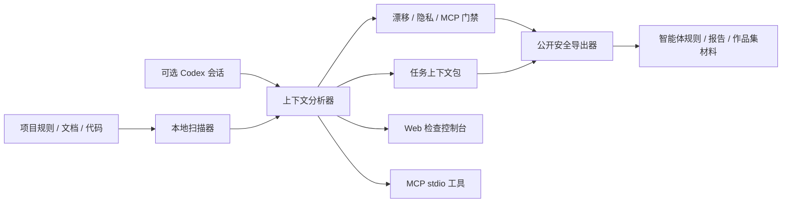

# Vibe Coding Context OS

一个本地优先的 AI 编程上下文操作系统。它会扫描项目规则、文档、代码、可选的 Codex 会话摘要和仓库信号，然后生成可复用的任务上下文包、智能体规则、隐私检查、MCP 工具和适合公开展示的 GitHub 作品集材料。

[English README](README.md)

## 它解决什么问题

现在很多人同时使用 Codex、Claude Code、Cursor、Gemini CLI、Cline、Continue 和各种 MCP 工具。真正影响 AI 编程效果的不是“再写一个提示词”，而是：

- 项目规则分散在 `AGENTS.md`、`CLAUDE.md`、Cursor rules、GitHub instructions 等多个地方。
- 长时间 vibe coding 后，会话里沉淀了很多经验，但没有变成可复用流程。
- 私有路径、`.env`、密钥、原始会话日志很容易误放进公开仓库。
- 不同 AI 编程工具的安全边界、验证习惯和交接格式不一致。

Vibe Coding Context OS 做的事情是把这些上下文变成一个可检查、可导出、可审计、可分享的工程资产。

## 它适合谁

它适合已经在使用 Codex、Claude Code、Cursor、Gemini CLI、Cline/Roo、Continue、GitHub Copilot 或 MCP 工具的开发者，用来管理项目规则、任务上下文、隐私门禁、工具策略和可公开展示的工程证据。

它不是另一个聊天机器人，也不是替代 AI 编程工具。它更像一个本地上下文治理层，让这些工具拿到更干净、更安全、更可复用的输入。

## 核心能力

- 扫描项目规则、文档、代码、manifest、GitHub/Cursor/Claude/Gemini/Cline/Continue 配置。
- 可选读取本地 Codex 会话摘要，但默认不导出原始会话文本。
- 生成面向 Codex、Claude Code、Cursor、Gemini CLI、Cline/Roo、Continue、GitHub Copilot 和 MCP 的规则文件。
- 生成任务上下文包 `TASK_PACK.md`，让 AI 编程工具拿到更紧凑的任务交接。
- 检查上下文漂移、隐私风险、MCP 配置风险、跨工具配置覆盖率和发布准备状态。
- 生成公开安全包，适合 GitHub README、个人主页、简历项目说明和演示截图。
- 提供 CLI、Web inspection console、本地 MCP stdio server 三种入口。
- Web 控制台支持英文/中文切换，CLI、MCP 和生成报告保持稳定英文，方便自动化和 GitHub 审查。

## 快速开始

要求 Node.js 22 或更新版本。

```bash
npm install
npm run dev
```

打开 `http://127.0.0.1:5173`。

后端 API 默认运行在 `http://127.0.0.1:8787`。如果你只是想安全体验产品，可以先扫描内置的公开 demo workspace：

```bash
npm run vibe -- demo
npm run vibe -- demo --public-bundle
npm run vibe -- demo --privacy-audit
```

## 示例输出

如果你想先看效果，不用安装也可以直接读 [docs/examples](docs/examples/README.md)。里面包含基于 `demo-workspace/` 生成的任务上下文包、公开上下文摘要、配置体检报告、MCP 工具策略、发布清单和 GitHub 个人主页片段。

## Agent 原生安装

安装到本机 Codex skill：

```bash
npm run agent:install:codex
```

安装到 Claude Code 用户级 skill：

```bash
npm run agent:install:claude-user
```

安装到某个 Claude Code 项目，并附带 slash command 模板：

```bash
npm run agent:install -- --claude-project "你的项目路径"
```

如果目标已存在，脚本会拒绝覆盖；确认后再额外加 `-- --force`。

更多文档：

- [架构说明](docs/ARCHITECTURE.md)
- [Agent 原生用法](docs/AGENT_NATIVE.md)
- [隐私模型](docs/PRIVACY.md)
- [展示指南](docs/SHOWCASE.md)
- [FAQ](docs/FAQ.md)
- [发布清单](docs/RELEASE.md)

## 常用命令

```bash
npm run vibe -- scan
npm run vibe -- status
npm run vibe -- drift
npm run vibe -- budget
npm run vibe -- pack --task "prepare this repository for public release"
npm run vibe -- export
npm run vibe -- public-bundle
npm run vibe -- publish-check
npm run vibe -- privacy-audit
npm run vibe -- artifact-audit
npm run vibe -- mcp-audit
npm run vibe -- config-doctor
npm run vibe -- config-fix-pack
npm run vibe -- trace
```

完整发布检查：

```bash
npm run release:check
```

## 架构概览



关键边界：所有扫描和总结都在本地完成；生成文件先写入 `exports/`；真正发布前只选择公开安全、人工审查过的产物。

## 隐私边界

- 默认不需要 LLM API key。
- 默认只写入 `exports/latest`、`exports/public` 和 `.vibe/`。
- 不会自动覆盖真实的 `AGENTS.md`、`CLAUDE.md`、Cursor rules 或其他智能体配置。
- `context-map.json` 默认会去掉原始片段、原始会话样本、绝对路径和 Codex home。
- `privacy-audit` 和 `artifact-audit` 会阻止疑似密钥、私有路径、`.env`、JSONL 会话日志进入公开产物。

## 适合展示的工程亮点

- 本地优先的 LLM 应用架构。
- Context engineering for AI coding agents。
- MCP stdio server 与多工具集成。
- AI 编程配置体检：Codex、Claude Code、Cursor、Gemini CLI、Cline/Roo、Continue、GitHub Copilot、MCP。
- 隐私优先的扫描、脱敏、发布门禁和公开安全导出。
- 适合个人主页和简历的真实工具项目，而不是一次性 demo。

## 推荐发布流程

```bash
npm run vibe -- init
npm run vibe -- scan
npm run vibe -- drift
npm run vibe -- budget
npm run vibe -- pack --task "prepare this repository for public release"
npm run vibe -- export
npm run vibe -- publish-check
npm run vibe -- privacy-audit
npm run vibe -- artifact-audit
npm run vibe -- mcp-audit
npm run vibe -- config-doctor
npm run vibe -- trace
npm run vibe -- apply-plan
```

公开分享时优先使用 `exports/public`、`PUBLIC_CONTEXT_SUMMARY.json`、`PUBLIC_RELEASE_CHECKLIST.md`、`GITHUB_PROFILE_SNIPPET.md` 和 demo workspace 截图。不要发布原始会话、私有路径、密钥或本机环境文件。
