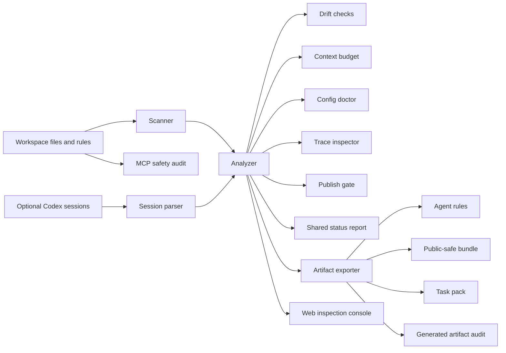

# Architecture

Vibe Coding Context OS is a local-first context compiler for AI coding workflows. It does not act as another coding agent. It organizes the context that Codex, Claude Code, Cursor, Gemini CLI, Cline, Roo, Continue, and other tools need to work safely.

## Data Flow



## Backend

- `server/scanner.ts` scans approved workspace files and applies redaction before snippets enter the analysis result.
- `server/codexSessions.ts` optionally parses recent Codex and workspace session logs when enabled through `.vibe/config.json`.
- `server/analyzer.ts` combines source files, sessions, risks, drift findings, budget, publish status, and recommendations.
- `server/exporter.ts` writes generated artifacts to `exports/latest` and public-safe artifacts to `exports/public`.
- `server/drift.ts`, `server/budget.ts`, and `server/publish.ts` provide release gates for stale context, context size, and privacy risk.
- `server/status.ts` builds one shared status report for the CLI, MCP server, API, and web console.
- `server/configDoctor.ts` checks cross-agent config coverage across Codex, Claude, Cursor, Gemini, Cline/Roo, Continue, Copilot, and MCP targets.
- `server/trace.ts` builds session-summary diagnostics for context pressure, continuation loops, verification gaps, and private-path signals without exporting raw session text.
- `server/applyPlan.ts` produces a dry-run map from generated artifacts to real agent-rule targets.
- `server/privacyAudit.ts` scans publishable source files for environment files, JSONL session logs, secret-like values, and private absolute paths.
- `server/artifactAudit.ts` scans generated exports for private paths, raw session logs, and secret-like values.
- `server/mcpAudit.ts` scans MCP configs for `npx` runtime installs, unpinned packages, broad command surfaces, sensitive env keys, and private paths.

## Agent-Native Surfaces

The primary product surface is agent-native:

- `codex-skill/vibe-context-os` for Codex and Claude Code skill-style workflows.
- `agent-kit/claude-code/commands` for Claude Code slash command templates.
- `vibe-context mcp` for MCP-capable coding clients.
- `vibe-context pack/status/privacy-audit/...` for any shell-capable agent.

The web app should be treated as an inspection console, not the main daily workflow.

## Frontend

The React app is an inspection console, not a marketing page or the primary agent workflow. It shows:

- Workspace and session metrics.
- Context categories and workflow stages.
- Drift and privacy findings.
- MCP safety findings.
- Cross-agent config coverage and consistency findings.
- Trace pressure, continuation, and verification findings.
- Task pack generation.
- Export and public bundle controls.
- Apply Plan status for real agent files.

## CLI

The CLI is the primary automation surface:

```bash
npm run vibe -- scan
npm run vibe -- drift
npm run vibe -- budget
npm run vibe -- publish-check
npm run vibe -- artifact-audit
npm run vibe -- mcp-audit
npm run vibe -- config-doctor
npm run vibe -- trace
npm run vibe -- apply-plan
npm run vibe -- pack --task "..."
npm run vibe -- export
npm run vibe -- public-bundle
npm run vibe -- privacy-audit
```

Most commands support `--json` for CI, MCP wrappers, or other coding agents.

## Write Boundaries

The app writes only to:

- `exports/latest`
- `exports/public`
- `.vibe/` during `vibe init`

Generated agent files are not auto-applied to `AGENTS.md`, `CLAUDE.md`, `.cursor/rules`, or other real project-rule files.

Generated exports now cover common agent surfaces: Codex `AGENTS.md`, Claude Code `CLAUDE.md` plus project skills, Cursor rules, Gemini CLI, Cline/Roo, Continue, GitHub Copilot repository instructions, MCP policy, config doctor report, trace report, and reviewable MCP client config.

## Distribution Surface

The package exposes `vibe-context` after build and keeps the npm tarball focused on built server/UI assets, docs, the Codex skill template, and the clean demo workspace. CI runs `npm run pack:check` so packaging drift is caught before release.
